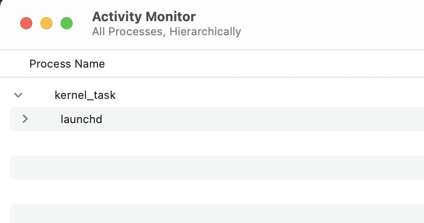

launchd is like systemd

A LaunchDaemon is run as root and starts before any user sessions begin

A LaunchAgent is run as your user and starts when you log in

Both are controlled by `launchd` and `.plist` files in 
* /System/Library/LaunchAgents
* /System/Library/LaunchDaemons
* /Library/LaunchAgents
* /Librray/LaunchDaemons
* ~/Library/LaunchAgents
* ~/Library/LaunchDaemons

I verified a bit by looking at the files in /System/Library/LaunchAgents and they are all running and owned by my user

There is a LOT of stuff that runs at launch in macOS

You can see evidence that launchd launches EVERYTHING here

https://developer.apple.com/documentation/servicemanagement/smappservice/register()#Discussion

